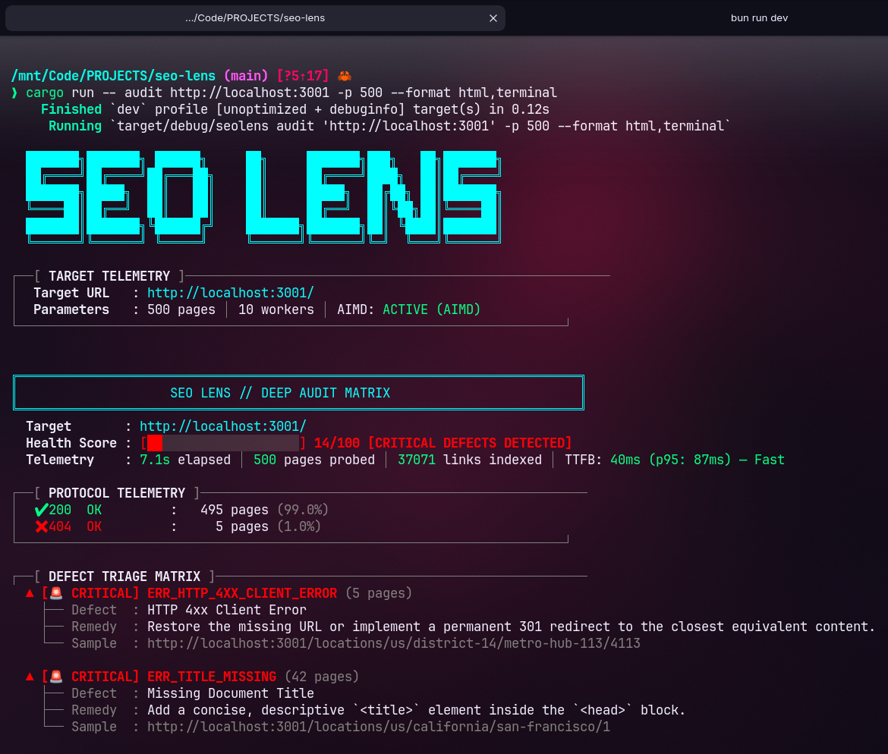
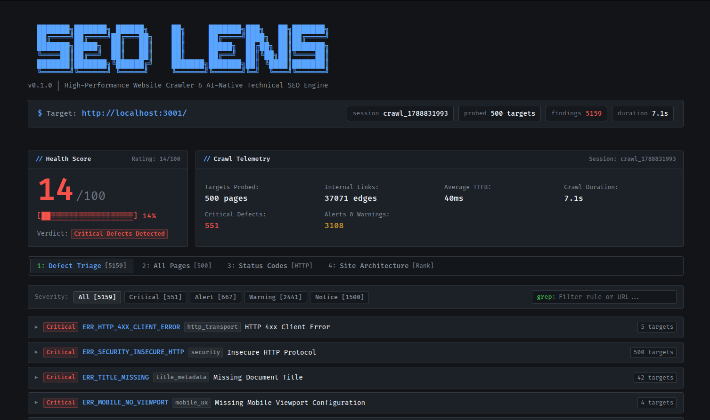

# SEO Lens

**High-performance, local-first website crawler, 120-rule technical SEO audit engine, and AI-native auditor written in Rust.**

[](./LICENSE-MIT)


---

## Overview

**SEO Lens** is a lightweight, blazing-fast website crawler and technical SEO auditor designed as a modern, local-first alternative to heavy legacy tools like Screaming Frog and expensive cloud crawlers.

Built from the ground up in Rust, SEO Lens streams HTML responses through Cloudflare's zero-copy `lol_html` parser, dynamically adjusts crawl speed using network congestion algorithms (AIMD), persists audit history in an embedded SQLite database, and exposes a native **Model Context Protocol (MCP)** server for autonomous AI coding agents.





---

## Key Features

- ⚡ **Blazingly Fast**: Crawls ~500–800 pages/second on raw HTTP using under 50 MB of RAM.
- 🔒 **Local-First & Private**: All data stays on your machine in an embedded SQLite WAL database. No accounts, no cloud dependencies, zero telemetry.
- 🧠 **AI-Native (MCP)**: Native stdio Model Context Protocol server. AI agents in Claude Desktop, Cursor, and Windsurf can launch audits and inspect findings autonomously.
- 🛡️ **AIMD Congestion Politeness**: Additive-Increase / Multiplicative-Decrease rate controller actively protects target servers from overload.
- 🔍 **120 Comprehensive Rules**: Validates HTTP transport, metadata, headings, directives, canonicalization, links, security headers, CLS image dimensions, hreflang reciprocity, and Google Rich Results.
- 🤖 **GEO & AI Search Readiness**: Audits `/llms.txt`, probes AI crawler permissions (`GPTBot`, `ClaudeBot`), and flags bot-challenge firewall screens.
- 🕸️ **Topology & Internal PageRank**: Ingests link graphs into `petgraph` to detect orphan pages, canonical loops, and distribute internal link equity.
- 📊 **Multi-Format Reporting**: Generates interactive standalone TUI-style HTML reports, Screaming Frog-compatible CSV suites, Markdown for LLMs, and structured JSON.

---

## Quickstart

> **Prerequisites**: Requires **Rust 1.80+** ([rustup.rs](https://rustup.rs/)). On Linux, ensure `build-essential`, `pkg-config`, and `libssl-dev` are installed (see [CONTRIBUTING.md](./CONTRIBUTING.md) for OS-specific details).

### 1. Clone the Repository

```bash
git clone https://github.com/Shantodotdev/seo-lens.git
cd seo-lens
```

### 2. Choose How to Run

You have three flexible options depending on your workflow:

#### Option A: Run Directly with Cargo (Best for quick testing)

Run audits immediately without installing anything to your system PATH:

```bash
# Cargo compiles and runs seolens on the fly
cargo run -- audit https://example.com --max-pages 100
```

#### Option B: Build the Standalone Binary (Best for production & scripts)

Build a self-contained, optimized release binary into `./target/release/seolens`:

```bash
# Compile optimized release binary
cargo build --release

# Run the binary directly
./target/release/seolens audit https://example.com --max-pages 500
```

#### Option C: Install Globally as a System Command (Best for daily use)

`cargo install --path .` compiles the release binary and copies it to your global Cargo binary directory (`~/.cargo/bin`). This makes `seolens` available from **any folder** in your terminal like any standard Unix tool:

```bash
# Install to ~/.cargo/bin/seolens
cargo install --path .

# Now available globally from any terminal folder
seolens audit https://example.com --max-pages 500
```

---

### Basic Usage

#### 1. Audit a Website

```bash
# Run a 500-page crawl with concurrency limit of 10
seolens audit https://example.com --max-pages 500 -c 10
```

#### 2. Quick Single-Page Inspection

```bash
# Inspect a single URL instantly without crawling the whole site
seolens inspect https://example.com/blog/post-1
```

#### 3. Inspect Issues by Severity

```bash
# List all critical and alert issues from the latest session
seolens issues <SESSION_ID> --severity critical,alert
```

#### 4. Export Reports

```bash
# Export an interactive HTML dashboard and Screaming Frog-compatible CSVs
seolens report <SESSION_ID> -f html,csv -o ./reports
```

#### 5. Check AI Search Readiness

```bash
# Check /llms.txt and AI bot permissions in robots.txt
seolens check-ai https://example.com
```

---

## Use with AI Agents (MCP)

SEO Lens includes a built-in Model Context Protocol (MCP) server running pure-Rust JSON-RPC 2.0 over `stdio`.

### Quick Setup

Tell your AI coding agent (Claude, Cursor, Windsurf) to register SEO Lens:

> _"Add an MCP server named `seolens` with the command `seolens` and args `['mcp']`."_

### What Agents Can Do

- **`seo_start_audit`**: Spawns non-blocking background crawls (returns a session token in $<1$s).
- **`seo_audit_status`**: Polls live crawl progress, page counts, and real-time health score.
- **`seo_get_markdown_report`**: Generates executive Markdown summaries tailored for LLM context windows.
- **`seo_query_issues`**: Filters issues by category, severity, and rule code.
- **`seo_quick_page_check`**: Instantly audits single URLs during local development.

_(See [Model Context Protocol Guide](./docs/mcp.md) for full tool schemas and configurations)._

---

## Documentation

Explore the complete technical documentation in [`docs/`](./docs/README.md):

| Guide                                                | Description                                                                     |
| ---------------------------------------------------- | ------------------------------------------------------------------------------- |
| [**Architecture & Roadmap**](./docs/architecture.md) | Pipeline design, 2-member workspace, streaming parsing, and project milestones. |
| [**CLI Commands & Flags**](./docs/cli.md)            | Exhaustive reference for all 10 subcommands, CLI options, and exporters.        |
| [**Crawler Engine & AIMD**](./docs/crawler.md)       | Asynchronous crawler mechanics, AIMD rate tuning, and RFC 9309 compliance.      |
| [**Model Context Protocol (MCP)**](./docs/mcp.md)    | Agent configuration, stdio JSON-RPC architecture, and 8 structured tools.       |
| [**120 SEO Rules Catalog**](./docs/rules.md)         | Complete reference of all 120 technical checks, heuristics, and fix advice.     |
| [**Storage & SQLite Schema**](./docs/storage.md)     | Database architecture, WAL mode, 7 relational tables, and SQL query recipes.    |

---

## Contributing

We welcome contributions! Please review [CONTRIBUTING.md](./CONTRIBUTING.md) for development setup, testing guidelines, and instructions on how to add new SEO rules.

---

## License

SEO Lens is dual-licensed under either:

- **MIT License** ([LICENSE-MIT](./LICENSE-MIT))
- **Apache License, Version 2.0** ([LICENSE-APACHE](./LICENSE-APACHE))

at your option.
