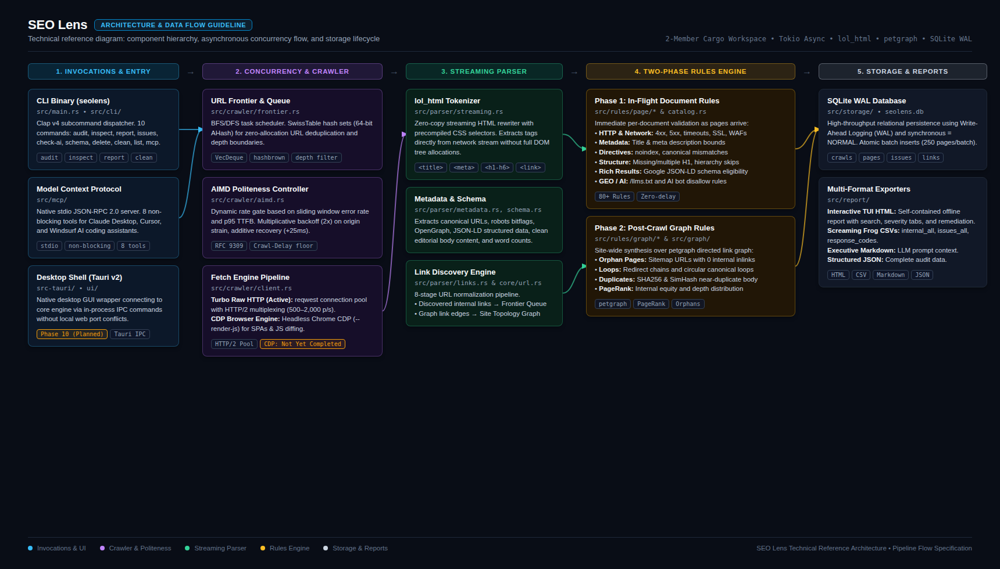

# SEO Lens Architecture & Engineering Guide

Welcome to the SEO Lens codebase! This document provides an architectural tour of SEO Lens: why it exists, how it is organized, how data flows through the system, and how you can contribute effectively.

---

## 1. What is SEO Lens?

**SEO Lens** is a high-performance, local-first website crawler, 120-rule technical SEO audit engine, and AI-native auditor written in Rust.

### The Problem It Solves

Traditional SEO crawlers (like Screaming Frog or Sitebulb) are heavy, memory-hungry desktop programs, while modern cloud crawlers are expensive and send your client data to third-party servers. On the developer side, open-source crawlers written in Python or Node.js are often slow, struggle on sites with thousands of URLs, and consume gigabytes of RAM.

### The SEO Lens Approach

- **Blazingly Fast & Lightweight**: Crawls ~500-800 pages/second on raw HTTP using under 50 MB of RAM.
- **Local-First & Private**: Runs entirely on your machine. Audits are stored in a local SQLite database in Write-Ahead Logging (WAL) mode.
- **Smart Dual-Engine**: Ultra-fast HTTP streaming by default, with opt-in Chrome DevTools Protocol (CDP) for JavaScript-heavy Single Page Applications (SPAs).
- **Two-Phase Audit Engine**: 120 rules split into immediate single-page checks (metadata, headings, status codes, schema) and post-crawl graph synthesis (orphan pages, canonical loops, internal PageRank).
- **AI-Native (MCP)**: Native Model Context Protocol server over `stdio`, allowing AI agents (Claude, Cursor, Windsurf) to launch audits, check progress, and query issues autonomously.
- **Zero Port Conflicts**: Distributed as a standalone CLI executable and an upcoming native desktop application shell.

---

## 2. Workspace Structure (2-Member Cargo Workspace)

SEO Lens is organized as a **2-member Cargo workspace**:

```bash
seo-lens/
├── Cargo.toml                # Workspace manifest + Member 1 (Core Engine & CLI)
├── src/                      # Core engine library & headless CLI
│   ├── lib.rs                # Library root (seo_lens crate)
│   ├── main.rs               # Headless CLI entry point (seolens binary)
│   ├── cli/                  # Command-line interface (10 subcommands via clap v4)
│   ├── core/                 # Domain models, URL normalization, crawl config
│   ├── crawler/              # HTTP client, AIMD politeness, frontier, robots/sitemaps
│   ├── parser/               # Streaming HTML tokenizer (lol_html), metadata, schema
│   ├── rules/                # 120 Technical SEO audit rules (single-page & graph)
│   ├── graph/                # petgraph internal link topology & PageRank
│   ├── storage/              # SQLite WAL persistence layer
│   ├── mcp/                  # Native Model Context Protocol (MCP) stdio server
│   └── report/               # Exporters (interactive TUI HTML, CSVs, Markdown, JSON)
├── src-tauri/                # Member 2: Tauri v2 desktop application wrapper
│   ├── Cargo.toml            # Desktop shell manifest (depends on seo-lens = { path = ".." })
│   └── src/                  # Desktop entry point and native OS window glue
├── tests/                    # Integration test suites and synthetic HTML fixtures
│   ├── fixtures/             # Sample HTML pages, sitemaps, and robots.txt files
│   ├── crawl_tests.rs        # Mock HTTP crawling tests (wiremock)
│   ├── rules_tests.rs        # 120-rule validation test suite
│   ├── mcp_tests.rs          # MCP JSON-RPC protocol tests
│   └── cli_tests.rs          # CLI subcommand and reporting tests
└── docs/                     # Specifications and architectural reference guides
```

### Why a 2-Member Workspace?

1. **Zero GUI Bloat in the CLI**: OS desktop libraries (`tauri`, `webkit2gtk`) only live inside `src-tauri`. The CLI binary (`seolens`) compiles to a lean, standalone binary (~15 MB) ideal for servers, CI/CD, and Docker containers.
2. **Shared Build Cache**: Core dependencies (`tokio`, `reqwest`, `serde`, `rusqlite`) are compiled once in the shared `target/` directory, saving disk space and compile times.
3. **One Engine, Multiple Interfaces**: The core engine in `src/` can be invoked by the CLI (`src/main.rs`), an AI coding assistant via MCP (`src/mcp/`), or the native desktop GUI (`src-tauri`).

---

## 3. High-Level System Architecture & Pipeline



The entire SEO Lens engine operates as an asynchronous, staged pipeline designed for maximum throughput and minimal memory consumption:

1. **Interfaces & Clients**: Invocations arrive via the headless CLI (`seolens audit`, `inspect`), an AI coding agent via the Model Context Protocol (`seolens mcp`), or the desktop application shell.
2. **Concurrency & Crawler Engine**: Discovered URLs enter the **Frontier Queue**. Asynchronous Tokio worker tasks fetch targets using connection-pooled HTTP/2 while the **AIMD Politeness Controller** dynamically scales delays and concurrency to protect origin servers.
3. **Streaming Parser (`lol_html`)**: HTML streams are parsed on the fly using zero-copy CSS selector handlers. Tags, links, and schemas are extracted immediately without building heavy in-memory DOM trees.
4. **Two-Phase Rules Engine**:
   - **Phase 1 (In-Flight)**: Instant document-level checks for titles, headings, directives, security headers, and schema completeness.
   - **Phase 2 (Post-Crawl Graph)**: The full site topology is ingested into an in-memory directed graph (`petgraph`) to detect orphan pages, redirect loops, and calculate internal PageRank equity.
5. **Persistence & Multi-Format Reporting**: Audits are committed in atomic batches to SQLite WAL storage and exported as interactive TUI HTML reports, Screaming Frog CSVs, LLM-optimized Markdown, or structured JSON.

---

## 4. Core Subsystems Explained

### 4.1 URL Normalization Pipeline (`src/core/url.rs`)

To prevent infinite crawl loops and duplicate fetching (e.g. `https://example.com`, `http://example.com/`, `https://example.com/?utm_source=fb`), all URLs pass through an 8-stage normalization pipeline:

1. **Scheme Lowercasing**: Resolves protocol-relative URLs (`//cdn.example.com` $\rightarrow$ `https://cdn.example.com`).
2. **Host Normalization**: Lowercases hostnames, strips root trailing dots.
3. **Port Stripping**: Drops default `:80` and `:443`.
4. **Path Resolution**: Normalizes dot segments (`/a/b/../c` $\rightarrow$ `/a/c`).
5. **Trailing Slash Consistency**: Standardizes directory path rules.
6. **Fragment Removal**: Drops `#anchor` fragments.
7. **Tracking Param Stripping**: Removes UTM, `fbclid`, `gclid`, and advertising noise.
8. **Facet & Query Protection**: Configurable query parameter limits (`--max-query-params`) and facet stripping (`--ignore-sorting-facets`) to eliminate e-commerce spider traps.

### 4.2 AIMD Politeness & Congestion Control (`src/crawler/aimd.rs`)

Unlike basic crawlers that hammer servers at fixed concurrency or rely on arbitrary sleep delays, SEO Lens implements **Additive-Increase / Multiplicative-Decrease (AIMD)** congestion control (similar to TCP Reno):

- **Healthy Operation**: Gradually ramps up concurrency and shaves delay by 25ms per successful sample window.
- **Server Distress (Errors or high latency)**: If the error rate exceeds 8% or p95 response time spikes, delay is immediately multiplied by 2x and concurrency is halved.
- **Respects Standards**: Honors `Crawl-Delay` directives in `/robots.txt` as a hard delay floor.

### 4.3 Streaming HTML Parser (`src/parser/`)

Rather than loading giant DOM trees into memory with standard parsing libraries, SEO Lens uses Cloudflare's **`lol_html`** streaming HTML rewriter:

- Pre-compiled CSS selectors extract `<title>`, `<meta>`, `<link>`, `<h1>`–`<h6>`, `<a>`, ``, and schema tags as bytes stream through the network.
- Memory consumption remains virtually flat regardless of page size.

### 4.4 Two-Phase Rules Engine (`src/rules/`)

Auditing is divided cleanly into two phases:

- **Phase 1: In-Flight Document Rules**: Run immediately as each page arrives (HTTP status, missing H1, title lengths, security headers, Google Rich Results schema validation, mobile viewports).
- **Phase 2: Post-Crawl Graph Rules**: Run after the crawl finishes across the entire site graph (orphan pages with no inlinks, redirect chains and loops, duplicate content via SimHash, internal PageRank equity).

### 4.5 SQLite Storage Layer (`src/storage/`)

- All audit data is persisted into an embedded SQLite database using **Write-Ahead Logging (`PRAGMA journal_mode = WAL`)** and **`PRAGMA synchronous = NORMAL`**.
- Writes are batched in atomic chunks of 250 pages to ensure blazing disk throughput.
- By default, databases are stored in the user's OS data directory (`~/.local/share/seo-lens/data/seolens.db` on Linux), or locally in `./.seolens/seolens.db` when using the `-L` / `--local` flag.

### 4.6 Native In-Process MCP Server (`src/mcp/`)

SEO Lens embeds a native Model Context Protocol (MCP) server running JSON-RPC 2.0 over `stdio`:

- Built in pure Rust with Tokio channels (zero extra MCP crate dependencies).
- Exposes 8 structured tools (`seo_start_audit`, `seo_audit_status`, `seo_get_markdown_report`, etc.).
- Guaranteed non-blocking: Background audits return a session token in under 1 second, avoiding AI agent tool timeout limits.

---

## 5. Dual-Engine Strategy: HTTP vs. Headless Chrome

SEO Lens uses an intelligent dual-engine architecture:

1. **Engine 1: Turbo Raw HTTP (Default)**:
   - Processes 80–85% of standard websites (WordPress, Shopify, Astro, Laravel, Next.js with SSR).
   - Achieves 500–2,000 pages/second with $<50$ MB RAM.
   - Includes automatic **SPA Heuristic Detection**: If a page has `<div id="root"></div>` with empty text and no links, it alerts the user to re-run with `--render-js`.

2. **Engine 2: Headless Chrome CDP (`--render-js`) (Planned / Not Yet Completed)**:
   - For JavaScript-rendered Single Page Applications (SPAs).
   - **Status**: _Not yet completed_. Headless Chrome CDP integration is planned on the roadmap to support client-side rendered SPAs and raw HTML vs. rendered DOM diffing.
   - **Decoupled Architecture**: When implemented, Chromium will _not_ be bundled into the binary. SEO Lens will auto-detect host browser installations or connect via `--chrome-ws`.
   - **JavaScript SEO Diffing**: Will automatically compare raw server HTML with client-rendered DOM to detect canonical tampering, dynamically injected `noindex` tags, or hydration rendering failures.

---

## 6. Project Status & Roadmap

| Subsystem / Feature                     | Status               | Notes                                                                                           |
| :-------------------------------------- | :------------------- | :---------------------------------------------------------------------------------------------- |
| **Core Crawl Engine (Raw HTTP)**        | ✅ Complete          | Async Tokio pipeline, AIMD politeness, robots.txt, sitemaps.                                    |
| **120 SEO Rules Catalog**               | ✅ Complete          | Phase 1 in-flight + Phase 2 post-crawl graph checks.                                            |
| **petgraph Topology & PageRank**        | ✅ Complete          | Link graph, orphan detection, internal PageRank calculation.                                    |
| **SQLite WAL Persistence**              | ✅ Complete          | Batched atomic transactions, session history, session cleaning.                                 |
| **CLI (10 Subcommands)**                | ✅ Complete          | `audit`, `inspect`, `mcp`, `report`, `list`, `issues`, `check-ai`, `delete`, `clean`, `schema`. |
| **Model Context Protocol (MCP)**        | ✅ Complete          | In-process stdio JSON-RPC server with 8 non-blocking agent tools.                               |
| **Multi-Format Exporters**              | ✅ Complete          | Interactive TUI HTML report, Screaming Frog CSVs, Markdown, JSON.                               |
| **Headless Chrome CDP (`--render-js`)** | ⏳ Not Yet Completed | Planned decoupled CDP engine for JavaScript SPAs and DOM diffing.                               |
| **Native Desktop App (Tauri v2)**       | ⏳ Next Milestone    | Shell placeholder ready in `src-tauri`; React 19 UI in progress.                                |
| **Binary Packaging & Docker**           | ⏳ Next Milestone    | Multi-stage Dockerfile (`seolens:slim` and `seolens:full`).                                     |

---

## 7. Engineering Standards for Contributors

When writing code for SEO Lens, please follow these principles:

1. **Zero Panics in Library Code**: Never use `unwrap()` or `expect()` in `src/` library modules. All fallible operations must return `Result<T, SeoError>` using `thiserror`.
2. **Memory First**: Use `compact_str::CompactString` for strings $\le 24$ bytes (URLs, tags, MIME types) to keep memory stack-inlined. Use `bitflags` for boolean flags.
3. **Test-Driven Development (TDD)**: Write failing tests in `tests/` before adding new features or SEO rules. Verify with `cargo nextest run` (or `cargo test`).
4. **Clean Code & Formatting**: Run `cargo fmt --all` and ensure `cargo clippy` passes cleanly before submitting PRs.
