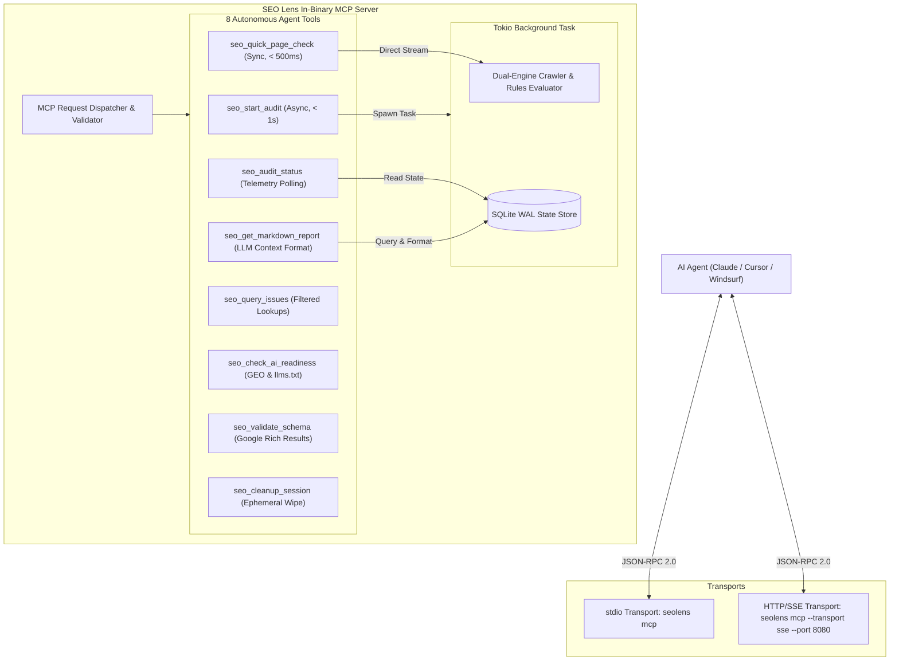

# SEO Lens: Model Context Protocol (MCP) Specification
**Document Status**: Permanent Technical Specification  
**Scope**: MCP Server Architecture, Agent Tools, JSON Schemas, Resources, and Protocol Transports

---

## 1. Architectural Role & Executive Overview

The **Model Context Protocol (MCP)** integration turns `SEO Lens` from a passive reporting tool into an active, autonomous **AI Agent Assistant**. 

Rather than dumping monolithic 20MB JSON or CSV files that overwhelm LLM context windows, `SEO Lens` embeds an in-process MCP server exposing an asymmetric, asynchronous API tailored for agent workflows.

---

## 2. Protocol Transports & Execution Lifecycle

`SEO Lens` implements the standard JSON-RPC 2.0 Model Context Protocol via the `rmcp` Rust crate:



### The Non-Blocking Asynchronous Guarantee
Most LLM client applications impose a strict **30 to 60-second timeout** on tool execution. A crawl of thousands of pages can take several minutes.
- Under **no circumstances** does `seo_start_audit` block until the crawl finishes.
- It validates the target URL, spawns a background Tokio task, registers the `session_id` in SQLite, and returns in **under 1.0 second**.
- The AI agent subsequently polls `seo_audit_status(session_id)` every 15–20 seconds until `status == "completed"`, then calls `seo_get_markdown_report(session_id)`.

---

## 3. The 8 Core MCP Tools Specification

Below is the exhaustive specification of all 8 MCP tools, including input schemas, parameter constraints, and return payloads.

---

### Tool 1: `seo_start_audit`
Kicks off a background crawl and technical audit for an entire website. Returns immediately with a session token.

#### Input Schema:
```json
{
  "type": "object",
  "properties": {
    "url": {
      "type": "string",
      "format": "uri",
      "description": "The root or starting URL to crawl (e.g. 'https://example.com')."
    },
    "max_pages": {
      "type": "integer",
      "default": 500,
      "minimum": 1,
      "maximum": 50000,
      "description": "Maximum number of pages to crawl."
    },
    "max_depth": {
      "type": "integer",
      "default": 5,
      "minimum": 1,
      "maximum": 20,
      "description": "Maximum click depth from the start URL."
    },
    "render_js": {
      "type": "boolean",
      "default": false,
      "description": "Enable headless Chrome CDP to render JavaScript and audit SPAs."
    },
    "respect_robots": {
      "type": "boolean",
      "default": true,
      "description": "Whether to fetch and obey /robots.txt rules."
    },
    "ai_geo_audit": {
      "type": "boolean",
      "default": true,
      "description": "Audit /llms.txt and AI bot crawler accessibility."
    }
  },
  "required": ["url"]
}
```

#### Return Payload:
```json
{
  "session_id": "c1f8a840-7e3f-42e5-a6e1-9257e84999ab",
  "status": "queued",
  "target_url": "https://example.com",
  "message": "Audit started in background. Poll 'seo_audit_status' with session_id to monitor progress.",
  "poll_interval_seconds": 15
}
```

---

### Tool 2: `seo_audit_status`
Polls the live progress and operational telemetry of an active or finished audit.

#### Input Schema:
```json
{
  "type": "object",
  "properties": {
    "session_id": {
      "type": "string",
      "description": "The unique audit session ID returned by seo_start_audit."
    }
  },
  "required": ["session_id"]
}
```

#### Return Payload:
```json
{
  "session_id": "c1f8a840-7e3f-42e5-a6e1-9257e84999ab",
  "status": "crawling", // "queued" | "crawling" | "analyzing_graph" | "completed" | "failed"
  "pages_crawled": 142,
  "pages_discovered": 380,
  "current_delay_ms": 125,
  "p95_ttfb_ms": 340,
  "error_rate_pct": 0.0,
  "issues_count": {
    "critical": 3,
    "alert": 12,
    "warning": 45,
    "notice": 18
  },
  "elapsed_seconds": 45,
  "is_complete": false
}
```

---

### Tool 3: `seo_get_markdown_report`
Generates a structured, concise Markdown report engineered specifically for LLM context windows.

#### Input Schema:
```json
{
  "type": "object",
  "properties": {
    "session_id": {
      "type": "string",
      "description": "The audit session ID."
    },
    "top_issues_limit": {
      "type": "integer",
      "default": 20,
      "description": "Maximum number of distinct issue types to summarize."
    },
    "include_urls": {
      "type": "boolean",
      "default": true,
      "description": "Include sample affected URLs for each issue."
    }
  },
  "required": ["session_id"]
}
```

#### Return Payload:
Returns a pure Markdown document formatted with clear headings, severity indicators, and exact code fix instructions (see Section 4 for format).

---

### Tool 4: `seo_quick_page_check`
Performs an instant, synchronous audit of a single URL in $< 500\text{ms}$. Ideal for testing a specific landing page or verifying a code fix immediately.

#### Input Schema:
```json
{
  "type": "object",
  "properties": {
    "url": {
      "type": "string",
      "format": "uri",
      "description": "Single URL to fetch and audit."
    },
    "render_js": {
      "type": "boolean",
      "default": false,
      "description": "Execute JavaScript via headless Chrome."
    }
  },
  "required": ["url"]
}
```

#### Return Payload:
```json
{
  "url": "https://example.com/pricing",
  "status_code": 200,
  "ttfb_ms": 145,
  "title": "Pricing Plans | Example SaaS",
  "meta_description": "Affordable plans for teams of all sizes.",
  "h1": "Transparent Pricing",
  "canonical_url": "https://example.com/pricing",
  "word_count": 840,
  "is_indexable": true,
  "issues_detected": [
    {
      "code": "WARN_IMG_MISSING_ALT",
      "severity": "warning",
      "message": "2 images missing alt attributes."
    },
    {
      "code": "WARN_SECURITY_MISSING_HSTS",
      "severity": "warning",
      "message": "Missing Strict-Transport-Security header."
    }
  ]
}
```

---

### Tool 5: `seo_query_issues`
Queries specific issues from an audit database, filtered by severity, category, or URL pattern.

#### Input Schema:
```json
{
  "type": "object",
  "properties": {
    "session_id": {
      "type": "string",
      "description": "The audit session ID."
    },
    "severity": {
      "type": "string",
      "enum": ["critical", "alert", "warning", "notice"],
      "description": "Optional severity filter."
    },
    "category": {
      "type": "string",
      "description": "Optional category filter (e.g. 'canonicalization', 'security', 'indexability')."
    },
    "url_pattern": {
      "type": "string",
      "description": "Optional SQL LIKE or glob pattern (e.g. '%/blog/%')."
    },
    "limit": {
      "type": "integer",
      "default": 50,
      "maximum": 500,
      "description": "Number of records to return."
    }
  },
  "required": ["session_id"]
}
```

#### Return Payload:
```json
{
  "total_matching": 4,
  "issues": [
    {
      "code": "ERR_CANONICAL_TO_4XX_5XX",
      "severity": "critical",
      "category": "canonicalization",
      "target_url": "https://example.com/old-page",
      "message": "Canonical points to broken URL returning 404: https://example.com/deleted",
      "source_page_url": null
    }
  ]
}
```

---

### Tool 6: `seo_check_ai_readiness`
Audits whether a website is optimized for Generative Engine Optimization (GEO) and AI Search Engines (ChatGPT Search, Perplexity, Claude).

#### Input Schema:
```json
{
  "type": "object",
  "properties": {
    "url": {
      "type": "string",
      "format": "uri",
      "description": "The website base URL."
    }
  },
  "required": ["url"]
}
```

#### Return Payload:
```json
{
  "base_url": "https://example.com",
  "llms_txt_found": true,
  "llms_full_txt_found": false,
  "ai_crawler_access": {
    "retrieval_citation_bots": {
      "OAI-SearchBot": "ALLOWED",
      "ChatGPT-User": "ALLOWED",
      "PerplexityBot": "DISALLOWED",
      "Claude-User": "ALLOWED"
    },
    "training_bots": {
      "GPTBot": "DISALLOWED",
      "ClaudeBot": "DISALLOWED",
      "Google-Extended": "DISALLOWED"
    }
  },
  "citation_search_risk": "HIGH",
  "recommendations": [
    "PerplexityBot is blocked in robots.txt. Your site will not be cited as a source in Perplexity answers. Allow PerplexityBot to regain visibility."
  ]
}
```

---

### Tool 7: `seo_validate_schema`
Validates a raw JSON-LD or Schema.org block against Google Rich Results eligibility rules.

#### Input Schema:
```json
{
  "type": "object",
  "properties": {
    "json_ld": {
      "type": "string",
      "description": "The raw JSON-LD string or object snippet."
    },
    "target_type": {
      "type": "string",
      "description": "Optional expected @type (e.g. 'Product', 'Article', 'FAQPage')."
    }
  },
  "required": ["json_ld"]
}
```

#### Return Payload:
```json
{
  "is_valid_json": true,
  "detected_type": "Product",
  "is_rich_result_eligible": false,
  "missing_required_fields": ["offers"],
  "missing_recommended_fields": ["review", "aggregateRating"],
  "error_message": "Missing required Google Rich Result property 'offers' (price and availability)."
}
```

---

### Tool 8: `seo_cleanup_session`
Deletes audit records and artifacts from disk for a session.

#### Input Schema:
```json
{
  "type": "object",
  "properties": {
    "session_id": {
      "type": "string",
      "description": "The audit session ID to purge."
    }
  },
  "required": ["session_id"]
}
```

#### Return Payload:
```json
{
  "session_id": "c1f8a840-7e3f-42e5-a6e1-9257e84999ab",
  "purged": true,
  "bytes_freed": 1420800
}
```

---

## 4. LLM-Optimized Markdown Report Template

When an AI agent requests the report via `seo_get_markdown_report`, the output must be formatted for **maximum context efficiency** and **actionable code changes**:

```markdown
# Technical SEO Audit: example.com
**Health Score**: 78/100 | **Pages Crawled**: 450 | **Duration**: 42s
**Summary**: 2 Critical Issues, 5 Alerts, 14 Warnings

---

## 🚨 Critical Issues (Immediate Fix Required)

### 1. `ERR_CANONICAL_TO_4XX_5XX` (Affects 4 pages)
- **Problem**: `<link rel="canonical">` points to a 404 dead page.
- **Affected URLs**:
  - `https://example.com/products/shoes` -> `https://example.com/shoes-old` (404)
- **Action for Agent**: Update canonical tag in `src/pages/products/[slug].tsx` to point to self or active product URL.

### 2. `ERR_SECURITY_INSECURE_FORM` (Affects 1 page)
- **Problem**: Login `<form>` on HTTPS submits to `http://api.example.com/login`.
- **Affected URL**: `https://example.com/login`
- **Action for Agent**: Update form `action` to `https://api.example.com/login`.

---

## ⚠️ High-Priority Alerts

### 1. `ALERT_GEO_AI_RETRIEVAL_BOT_BLOCKED`
- **Problem**: `robots.txt` disallows `PerplexityBot`. Site is blocked from AI Search citations.
- **Action for Agent**: Edit `public/robots.txt` and remove `Disallow: /` under `User-agent: PerplexityBot`.

---

## 💡 Quick Wins for Agent
1. Add missing `<meta name="description">` to 12 landing pages.
2. Add `alt` attributes to 8 product thumbnails in `components/ProductCard.tsx`.
3. Add `Strict-Transport-Security: max-age=31536000` header in server config.
```

---

## 5. MCP Resources Specification

In addition to tools, `SEO Lens` exposes read-only MCP URI resources:
- `seo://crawls`: Lists all recent crawl sessions in SQLite.
- `seo://crawls/{session_id}/summary`: JSON summary of crawl metrics and health score.
- `seo://crawls/{session_id}/report`: Full Markdown report.
- `seo://crawls/{session_id}/issues`: Raw JSON array of all issues.

---

## 6. Summary

This specification gives AI agents a complete, non-blocking interface to inspect, diagnose, and remediate technical SEO defects on any website.
