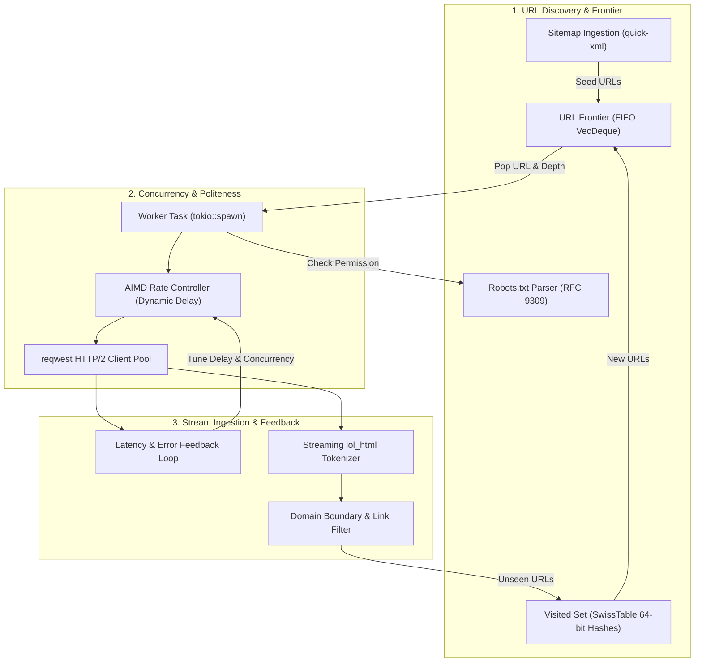
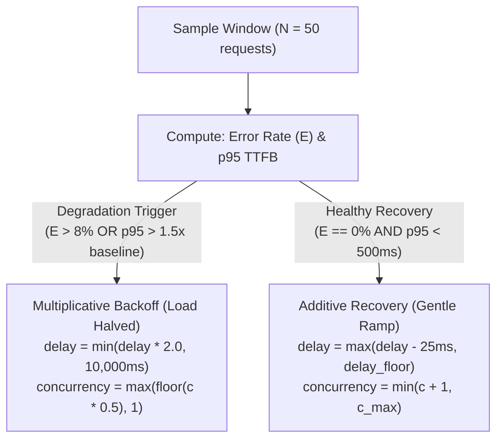

# SEO Lens: Crawler & Politeness Engine Guide

Welcome to the **Crawler & Politeness Engine Guide**!

This document provides a comprehensive tour of how SEO Lens navigates the web: how it discovers and queues URLs, respects web servers with adaptive congestion control, normalizes link targets to prevent duplicate visits, and parses robots and sitemaps with zero-copy efficiency.

---

## 1. Concurrency Architecture & Task Flow

SEO Lens uses an asynchronous producer-consumer pipeline built on the **Tokio** runtime:



### The 3 Pipeline Stages Explained

1. **Discovery & Frontier**: Seed URLs (or URLs discovered in sitemaps) are pushed into the Frontier Queue. Before any URL is enqueued, it is normalized and checked against the visited set using 64-bit fast hashing.
2. **Concurrency & Politeness Gate**: Worker tasks request permission from the RFC 9309 `robots.txt` engine and pass through the **AIMD rate controller**, which dynamically modulates delays based on server health.
3. **Stream Processing & Feedback**: As responses stream in, the client measures response latency (TTFB) and HTTP status codes, feeding this telemetry back to the AIMD controller to dynamically speed up or slow down the crawl rate.

---

## 2. The AIMD Adaptive Politeness Engine

### Why Politeness Matters

Crawling websites with aggressive concurrency without rate limiting can easily crash origin databases, trigger 429 Too Many Requests errors, or prompt Cloudflare/WAF IP bans.

To solve this, SEO Lens implements **Additive-Increase / Multiplicative-Decrease (AIMD)** congestion control—the same foundational algorithm that powers TCP Reno on the Internet:

### The AIMD Decision Cycle



### AIMD Control Parameters

| Parameter | Symbol | Default Value | Engineering Rationale |
| :--- | :--- | :--- | :--- |
| **Sample Window** | $W$ | `50 requests` | Smooths statistical outliers while reacting to server distress in $<3$ seconds. |
| **Error Rate Ceiling** | $E_{\text{thresh}}$ | `0.08` (8%) | If $>4$ out of 50 requests fail (429, 500, 502, 503, 504), origin is in distress. |
| **Latency Multiplier** | $L_{\text{factor}}$ | `1.5` | If p95 TTFB exceeds $1.5\times$ baseline, the backend is experiencing query queueing. |
| **Multiplicative Backoff** | $\beta$ | `2.0` | Instantly halves origin load when strain or rate limiting is detected. |
| **Additive Recovery Step** | $\Delta_{\text{add}}$ | `25 ms` | Gently reduces delay by 25ms per successful window without shocking the origin. |
| **Max Delay Ceiling** | $\text{delay}_{\text{max}}$ | `10,000 ms` | Prevents infinite stalls by capping maximum request delay at 10 seconds. |
| **Delay Floor** | $\text{delay}_{\text{floor}}$ | $\max(\text{robots\_delay}, 0\text{ms})$ | Strictly honors `Crawl-Delay` directives in `/robots.txt`. |

> [!TIP]
> When testing local staging environments or high-throughput benchmarks, you can bypass dynamic AIMD rate adjustments using the `--no-aimd` flag.

---

## 3. URL Normalization Pipeline

Discovered links often point to the same destination under different formats (e.g. `https://example.com`, `http://example.com/`, `https://example.com/?utm_source=twitter`).

To guarantee that each unique page is crawled **exactly once**, all URLs pass through an 8-stage normalization pipeline in `src/core/url.rs`:

```text
Raw Href ──> [1. Scheme] ──> [2. Hostname] ──> [3. Port] ──> [4. Path]
         ──> [5. Trailing Slash] ──> [6. Strip Fragments]
         ──> [7. Strip Tracking Query] ──> [8. Sort Query] ──> Normalized URL
```

### Step-by-Step Normalization Rules

1. **Scheme Lowercasing**: Converts scheme to lowercase (`HTTP` $\rightarrow$ `http`). Resolves protocol-relative URLs (`//cdn.example.com` $\rightarrow$ `https://cdn.example.com`).
2. **Hostname Lowercasing & Root Dot Removal**: Lowercases domain names (`Example.COM` $\rightarrow$ `example.com`) and removes trailing root dots (`example.com.` $\rightarrow$ `example.com`).
3. **Default Port Stripping**: Drops standard ports (`:80` for HTTP, `:443` for HTTPS).
4. **Path Segment Resolution**: Resolves dot segments (`/a/b/../c` $\rightarrow$ `/a/c`) and collapses consecutive slashes (`/blog//post` $\rightarrow$ `/blog/post`).
5. **Root Path Enforcement**: If path is empty, ensures root `/` is present (`https://example.com` $\rightarrow$ `https://example.com/`).
6. **Fragment Removal**: Drops anchor fragments (`/page#reviews` $\rightarrow$ `/page`).
7. **Tracking Parameter Stripping**: Automatically strips marketing and analytics tracking noise:
   - `utm_source`, `utm_medium`, `utm_campaign`, `utm_term`, `utm_content`
   - `fbclid`, `gclid`, `msclkid`, `mc_eid`, `_ga`, `_gl`, `ref`
8. **Deterministic Query Sorting**: Lexicographically sorts legitimate query parameters (`?b=2&a=1` $\rightarrow$ `?a=1&b=2`).

### Spider Trap & Facet Protection

E-commerce and filtered catalog sites often generate infinite calendar loops or faceted navigation spider traps. SEO Lens provides two built-in guardrails:

- **`--max-query-params <N>`** (default: `2`): Limits the number of permissible query parameters before flagging or pruning candidate URLs.
- **`--ignore-sorting-facets`** (default: `true`): Automatically strips sorting and display facets (e.g. `sort=price_desc`, `order=date`, `view=grid`) that produce duplicate content.

### Hash-Based Deduplication

After normalization, each URL string is converted into a **64-bit AHash (`u64`)**:

- The `VisitedSet` in `src/crawler/frontier.rs` stores only `u64` values in a SwissTable (`hashbrown::HashSet<u64>`).
- Storing 50,000 URLs consumes **under 400 KB of RAM** (compared to $>10$ MB for raw string vectors).

---

## 4. Frontier Queue & Depth Management

The crawler frontier schedules pending URLs and enforces crawl boundaries:

```rust
pub struct FrontierEntry {
    pub url: String,
    pub depth: u16,
    pub source_url: Option<String>,
}
```

### Scheduling Policies

1. **Breadth-First Search (BFS) (Default)**:
   - Uses `VecDeque<FrontierEntry>` (FIFO queue).
   - Ensures shallow, high-PageRank category pages are audited first before digging into deep pagination or leaf nodes.
2. **Depth Limiting**:
   - When a link is discovered on a page at `depth = d`, candidate entries are assigned `depth = d + 1`.
   - If `d + 1 > max_depth`, the URL is added to the site link graph as an edge but is **never enqueued for crawling**.
3. **Domain Boundary Control**:
   - **Internal Domain**: Host matches the starting domain (or subdomains if enabled). Crawled recursively.
   - **External Domain**: Outbound link. Validated with a lightweight status check, but outgoing links are not extracted.

---

## 5. RFC 9309 Robots.txt & Sitemap Compliance

### 5.1 Robots.txt Rules (`src/crawler/robots.rs`)

SEO Lens adheres strictly to **RFC 9309 (Robots Exclusion Protocol)**:

1. **User-Agent Matching**:
   - Specific user-agent matches take precedence over wildcard `*`.
   - Priority hierarchy: `SEOLens` $\rightarrow$ `Googlebot` $\rightarrow$ `*`.
2. **Longest Match Precedence**:
   - When multiple directives match a path, the rule with the longest character pattern wins:

   ```text
   Allow: /products/
   Disallow: /products/archived/
   # URL: /products/archived/item-1 -> DISALLOWED (20 chars vs 10 chars)
   ```

3. **Allow Overrides Disallow on Equal Length**:
   - If `Allow: /blog` and `Disallow: /blog` have identical pattern lengths, `Allow` takes precedence per RFC 9309.
4. **Wildcards**: Fully supports `*` (zero or more characters) and `$` (end of URL pattern).

### 5.2 Streaming Sitemap Ingestion (`src/crawler/sitemap.rs`)

Uses `quick-xml` for zero-allocation streaming XML parsing:

1. **Auto-Discovery**:
   - Checks `Sitemap:` declarations in `/robots.txt`.
   - Probes standard paths: `/sitemap.xml`, `/sitemap_index.xml`, `/wp-sitemap.xml`.
2. **Sitemap Index Recursion**:
   - Recursively expands nested `<sitemapindex>` entries up to 3 levels deep.
3. **Compressed Sitemaps (`.xml.gz`)**:
   - Automatically detects compressed `.gz` sitemaps and streams decompression on the fly using `flate2`.
4. **Orphan Page Detection**:
   - Sourced URLs are tagged with `is_sitemap_url = true`.
   - If post-crawl analysis finds that a sitemap URL has 0 incoming internal links from crawled HTML pages, `ALERT_GRAPH_ORPHAN_PAGE` is triggered.

---

## 6. WAF & Anti-Bot Fingerprint Detection (`src/crawler/waf.rs`)

When crawling client sites protected by Cloudflare, Akamai, or DataDome, firewalls often return HTTP 200 or 403 with a JavaScript challenge screen. Parsing challenge pages blindly would flood audit reports with false alarms ("missing title", "zero words", "missing H1").

SEO Lens inspects response bodies for known challenge signatures:

```rust
pub struct WafProbe {
    pub provider: &'static str,
    pub signatures: &'static [&'static str],
}

pub const WAF_SIGNATURES: &[WafProbe] = &[
    WafProbe {
        provider: "Cloudflare",
        signatures: &[
            "cf-browser-verification",
            "checking your browser before accessing",
            "cloudflare ray id",
            "/cdn-cgi/challenge-platform/",
        ],
    },
    WafProbe {
        provider: "Akamai",
        signatures: &[
            "akamai bot manager",
            "_abck=",
            "reference&#32;number:",
            "bm-sz=",
        ],
    },
    WafProbe {
        provider: "DataDome",
        signatures: &[
            "geo.captcha-delivery.com",
            "datadome",
            "dd_cookie_test",
        ],
    },
    WafProbe {
        provider: "Imperva",
        signatures: &[
            "incapsula incident id",
            "_incap_ses",
            "visid_incap",
        ],
    },
];
```

When a challenge signature matches:

1. Flags `ALERT_WAF_BOT_CHALLENGE` on the URL.
2. Suppresses false-positive warnings for missing titles, H1s, or content.
3. Advises the user in the report: *"Blocked by Cloudflare/Akamai WAF challenge. Whitelist the crawler IP or supply a session cookie."*
