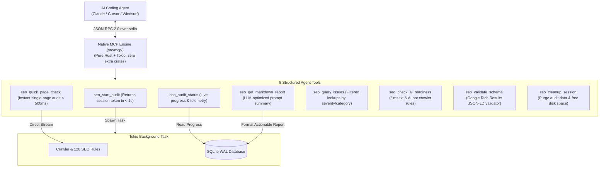

# SEO Lens: Model Context Protocol (MCP) Guide

Welcome to the **Model Context Protocol (MCP)** guide for **SEO Lens**!

SEO Lens features a native, in-process MCP server that turns it into an autonomous AI assistant for technical SEO auditing. Instead of dumping massive 20 MB JSON or CSV files that blow past LLM context limits, SEO Lens gives AI agents (like **Claude Desktop**, **Cursor**, **Windsurf**, and **Devin**) clean, purpose-built tools to launch audits, check progress, and query actionable code remediation instructions.

---

## 1. Quick Setup for AI Coding Agents

Running `seolens mcp` starts the native MCP server over standard input/output (`stdio`).

You can tell your AI agent to add the mcp server. Just copy and paste this prompt into your AI coding assistant (**Cursor**, **Claude Desktop**, **Windsurf**, **Cline**, or **Devin**):

> _"Add SEO Lens to my MCP configuration so you can audit websites, check SEO health, and validate schemas. Command: `seolens`, args: `[\"mcp\"]`."_

### Standard MCP Server JSON

```json
{
  "mcpServers": {
    "seolens": {
      "command": "seolens",
      "args": ["mcp"]
    }
  }
}
```

---

## 2. Server Architecture & The Non-Blocking Guarantee



### Why Non-Blocking Matters for AI Agents

Most AI agent interfaces impose a strict **30 to 60-second timeout** on tool execution. A full website crawl of several hundred pages can take 1 to 2 minutes.

- `seo_start_audit` **never blocks** waiting for the crawl to finish.
- It validates the URL, kicks off the crawl on a background Tokio task, registers the `session_id`, and returns in **under 1.0 second**.
- The agent can then poll `seo_audit_status` periodically until `status == "completed"`, and then retrieve a clean summary with `seo_get_markdown_report`.

---

## 3. The 8 Core MCP Tools

### Tool 1: `seo_start_audit`

Starts an asynchronous background website crawl and technical SEO audit.

**Input Parameters:**

- `url` (_string_, required): Starting URL (e.g. `"https://example.com"`).
- `max_pages` (_integer_, optional, default: `500`): Maximum pages to crawl.
- `max_depth` (_integer_, optional, default: `5`): Maximum click depth.
- `render_js` (_boolean_, optional, default: `false`): Enable headless Chrome CDP for JavaScript SPAs.
- `respect_robots` (_boolean_, optional, default: `true`): Whether to obey `/robots.txt`.
- `ai_geo_audit` (_boolean_, optional, default: `true`): Check `/llms.txt` and AI bot crawler rules.

**Sample Response:**

```json
{
  "session_id": "crawl_1788718395",
  "status": "queued",
  "target_url": "https://example.com",
  "message": "Audit started in background. Poll 'seo_audit_status' to monitor progress.",
  "poll_interval_seconds": 15
}
```

---

### Tool 2: `seo_audit_status`

Polls the live progress and operational telemetry of an ongoing or completed audit.

**Input Parameters:**

- `session_id` (_string_, required): Session ID returned by `seo_start_audit`.

**Sample Response:**

```json
{
  "session_id": "crawl_1788718395",
  "status": "crawling",
  "pages_crawled": 142,
  "pages_discovered": 380,
  "current_delay_ms": 125,
  "p95_ttfb_ms": 340,
  "issues_count": {
    "critical": 3,
    "alert": 12,
    "warning": 45,
    "notice": 18
  },
  "elapsed_seconds": 45,
  "is_complete": false
}
```

---

### Tool 3: `seo_get_markdown_report`

Generates a structured, concise Markdown report engineered specifically for LLM context windows, highlighting the most critical issues and specific code remediation guidance.

**Input Parameters:**

- `session_id` (_string_, required): The audit session ID.
- `top_issues_limit` (_integer_, optional, default: `20`): Max issue types to summarize.
- `include_urls` (_boolean_, optional, default: `true`): Include sample affected URLs for each issue.

---

### Tool 4: `seo_quick_page_check`

Performs an instant, synchronous audit of a single URL in $< 500\text{ms}$. Great for testing a specific landing page or verifying a code fix immediately.

**Input Parameters:**

- `url` (_string_, required): Single URL to fetch and audit.
- `render_js` (_boolean_, optional, default: `false`): Execute JavaScript via headless Chrome.

**Sample Response:**

```json
{
  "url": "https://example.com/pricing",
  "status_code": 200,
  "ttfb_ms": 145,
  "title": "Pricing Plans | Example SaaS",
  "meta_description": "Affordable plans for teams of all sizes.",
  "h1": "Transparent Pricing",
  "canonical_url": "https://example.com/pricing",
  "word_count": 840,
  "is_indexable": true,
  "issues_detected": [
    {
      "code": "WARN_IMG_MISSING_ALT",
      "severity": "warning",
      "message": "2 images missing alt attributes."
    }
  ]
}
```

---

### Tool 5: `seo_query_issues`

Queries specific issues from an audit database, filtered by severity, category, or URL pattern.

**Input Parameters:**

- `session_id` (_string_, required): The audit session ID.
- `severity` (_string_, optional): `"critical"`, `"alert"`, `"warning"`, or `"notice"`.
- `category` (_string_, optional): e.g. `"canonicalization"`, `"security"`, `"headings"`.
- `url_pattern` (_string_, optional): SQL LIKE or glob pattern (e.g. `"%blog%"`).
- `limit` (_integer_, optional, default: `50`): Max records to return.

---

### Tool 6: `seo_check_ai_readiness`

Audits whether a website is ready for Generative Engine Optimization (GEO) and AI Search Engines (ChatGPT Search, Perplexity, Claude).

**Input Parameters:**

- `url` (_string_, required): Website root URL.

**Sample Response:**

```json
{
  "base_url": "https://example.com",
  "llms_txt_found": true,
  "llms_full_txt_found": false,
  "ai_crawler_access": {
    "retrieval_citation_bots": {
      "OAI-SearchBot": "ALLOWED",
      "PerplexityBot": "DISALLOWED"
    },
    "training_bots": {
      "GPTBot": "DISALLOWED",
      "ClaudeBot": "DISALLOWED"
    }
  },
  "citation_search_risk": "HIGH",
  "recommendations": [
    "PerplexityBot is blocked in robots.txt. Your site will not be cited as a source in Perplexity answers. Allow PerplexityBot to regain visibility."
  ]
}
```

---

### Tool 7: `seo_validate_schema`

Validates a raw JSON-LD or Schema.org snippet against Google Rich Results guidelines.

**Input Parameters:**

- `json_ld` (_string_, required): Raw JSON-LD text or snippet.
- `target_type` (_string_, optional): Expected `@type` (e.g. `"Product"`, `"Article"`, `"FAQPage"`).

---

### Tool 8: `seo_cleanup_session`

Deletes audit records from SQLite for a session to free up disk space.

**Input Parameters:**

- `session_id` (_string_, required): Session ID to purge.

---

## 4. MCP URI Resources

In addition to tools, SEO Lens exposes read-only MCP URI resources:

- `seo://crawls`: Lists all recent crawl sessions.
- `seo://crawls/{session_id}/summary`: JSON summary of crawl metrics and health score.
- `seo://crawls/{session_id}/report`: Full Markdown report.
- `seo://crawls/{session_id}/issues`: Raw JSON array of all issues.

---

## 5. Testing the MCP Server Locally

You can test the MCP server manually or using the MCP Inspector:

```bash
# Test with npx @modelcontextprotocol/inspector
npx @modelcontextprotocol/inspector seolens mcp
```

Or run the automated integration tests:

```bash
cargo nextest run --test mcp_tests
```
