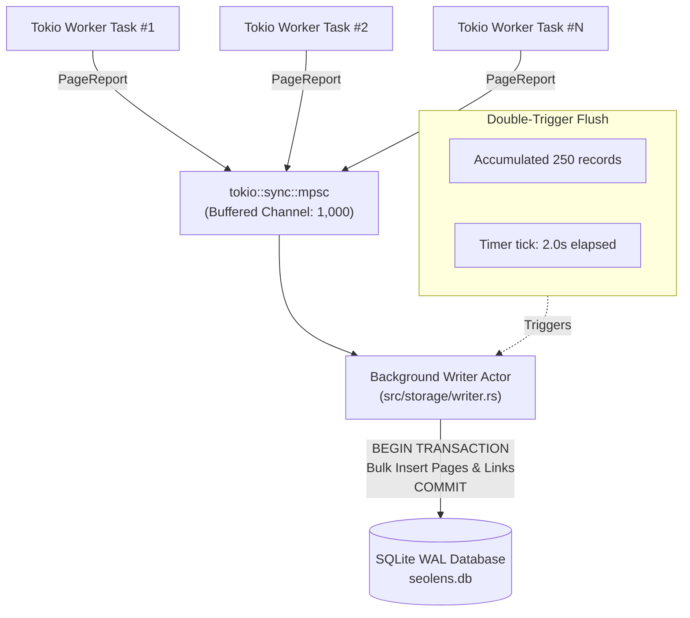

# Storage & SQLite Architecture

SEO Lens is **local-first**. All crawl sessions, discovered URLs, link topology, technical SEO issues, and structured data are persisted directly to a local SQLite database using Write-Ahead Logging (WAL).

No external database servers (like PostgreSQL or MySQL) or cloud accounts are required. Your audit data remains private on your machine and can be queried with sub-millisecond local latency.

---

## 1. Where the Database Lives

By default, SEO Lens stores audits in your operating system's standard user data directory so that crawl sessions persist across terminal sessions.

### Resolution Priority

SEO Lens resolves the database file path in the following order:

1. **CLI Flag (`--db-path <PATH>`)**: Explicit file path passed directly via the command line.
2. **Local Project Flag (`-L, --local`)**: Forces the database to `./.seolens/seolens.db` in your current working directory (ideal for project-specific audits and CI pipelines).
3. **Environment Variable (`SEOLENS_DB_PATH`)**: Overrides the default location system-wide.
4. **Operating System User Data Directory**:
   - **Linux**: `~/.local/share/seolens/seolens.db` (or `$XDG_DATA_HOME/seolens/seolens.db`)
   - **macOS**: `~/Library/Application Support/seolens/seolens.db`
   - **Windows**: `%LOCALAPPDATA%\seolens\seolens.db`

---

## 2. Storage Architecture

Crawling thousands of pages generates an intense stream of database writes (pages, outlinks, images, and issues). Writing to disk synchronously on every HTTP response would throttle crawler speed.

To achieve maximum throughput without blocking HTTP worker threads, SEO Lens uses an **Asynchronous Batch Writer Actor**:



### High-Throughput SQLite Tuning

The connection pool initializes SQLite with production-grade WAL parameters:

- **`PRAGMA journal_mode = WAL`**: Readers and writers never block each other.
- **`PRAGMA synchronous = NORMAL`**: Safe crash durability with minimal disk sync overhead.
- **`PRAGMA cache_size = -64000`**: Allocates 64 MB of RAM for the in-memory page cache.
- **`PRAGMA busy_timeout = 5000`**: Gracefully waits up to 5 seconds if a write transaction is busy.
- **`PRAGMA foreign_keys = ON`**: Enforces relational integrity across tables with cascade deletes.

---

## 3. Database Schema Overview

The definitive schema is maintained in [`../src/storage/schema.sql`](../src/storage/schema.sql), and the corresponding Rust domain models are defined in [`../src/core/models.rs`](../src/core/models.rs).

Here is a summary of the 7 core tables:

| Table | Description | Primary Key / Key Indexes |
| --- | --- | --- |
| **`crawls`** | Crawl sessions, target domain, crawl settings, overall health score, and status (`queued`, `crawling`, `completed`, `failed`). | `session_id TEXT` |
| **`pages`** | Comprehensive single-page audit reports: HTTP status, canonical, meta tags, TTFB, depth, word count, SimHash, and robots flags. | `id INTEGER`, indexed on `(crawl_id, url_hash)` |
| **`links`** | Directed edges in the site's link graph: source URL, target URL, anchor text, follow/nofollow, and target status. | `id INTEGER`, indexed on `(crawl_id, target_url_hash)` |
| **`issues`** | Specific technical SEO defects raised by the 120-rule audit engine. Severity levels: `1` (Critical), `2` (Alert), `3` (Warning), `4` (Notice). | `id INTEGER`, indexed on `(crawl_id, severity)`, `code` |
| **`schemas`** | Extracted JSON-LD and Microdata blocks with schema type and Google rich result eligibility. | `id INTEGER`, indexed on `crawl_id` |
| **`images`** | Image elements found on HTML pages with source URL, alt text, dimensions, and broken status. | `id INTEGER`, indexed on `crawl_id` |
| **`hreflangs`** | Internationalization alternate links with language codes and reciprocal validation status. | `id INTEGER`, indexed on `crawl_id` |

---

## 4. Querying the Database Directly

Because SEO Lens uses standard SQLite, you can query your crawl data directly using the `sqlite3` CLI, DB Browser for SQLite, or script it with Python/Node.js/Rust.

### Opening the Database

```bash
# Connect to the default user database
sqlite3 ~/.local/share/seolens/seolens.db

# Or connect to a local project database
sqlite3 ./.seolens/seolens.db
```

### Useful SQL Queries

#### 1. View recent crawl sessions

```sql
SELECT session_id, target_url, status, total_pages, health_score, started_at, finished_at
FROM crawls
ORDER BY started_at DESC
LIMIT 5;
```

#### 2. Group issues by severity and rule code

```sql
SELECT severity, code, title, COUNT(*) AS count
FROM issues
WHERE crawl_id = 'YOUR_SESSION_ID'
GROUP BY severity, code, title
ORDER BY severity ASC, count DESC;
```

#### 3. Find top broken internal links (404s) and where they are linked from

```sql
SELECT l.source_url, l.target_url, l.anchor_text, p.status_code
FROM links l
JOIN pages p ON l.crawl_id = p.crawl_id AND l.target_url_hash = p.url_hash
WHERE l.crawl_id = 'YOUR_SESSION_ID'
  AND p.status_code = 404
ORDER BY l.source_url ASC
LIMIT 50;
```

#### 4. Find slowest pages by response time (TTFB)

```sql
SELECT url, ttfb_ms, size_bytes, status_code
FROM pages
WHERE crawl_id = 'YOUR_SESSION_ID'
ORDER BY ttfb_ms DESC
LIMIT 20;
```

#### 5. Find missing `<title>` or meta descriptions

```sql
SELECT url, title_length, meta_desc_length
FROM pages
WHERE crawl_id = 'YOUR_SESSION_ID'
  AND (title IS NULL OR meta_description IS NULL)
LIMIT 50;
```

---

## 5. Cleaning Up Old Data

You don't need to manually run SQL `DELETE` queries. SEO Lens includes built-in commands to manage disk usage:

```bash
# Delete a specific crawl session (cascades across all tables)
seolens delete <SESSION_ID>

# Delete sessions older than 30 days
seolens clean --older-than 30d

# Delete all historical crawl sessions
seolens clean --all
```
